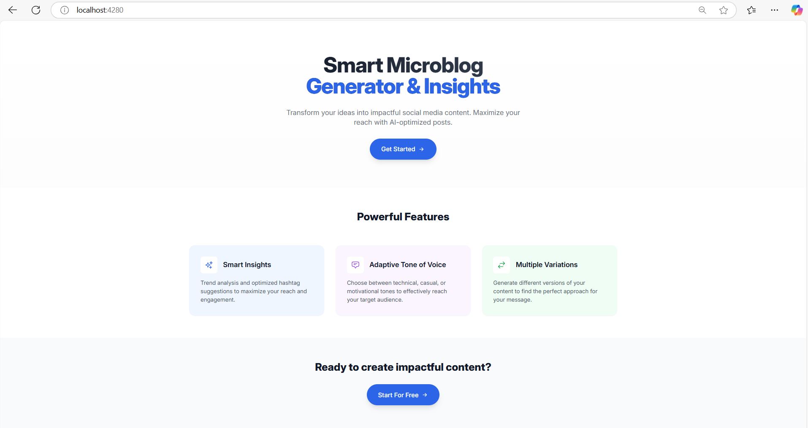
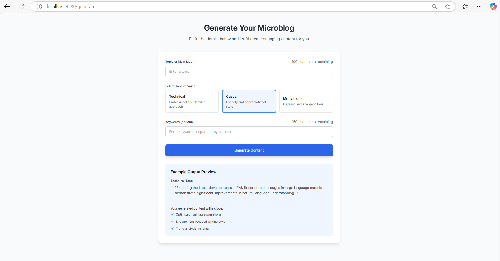
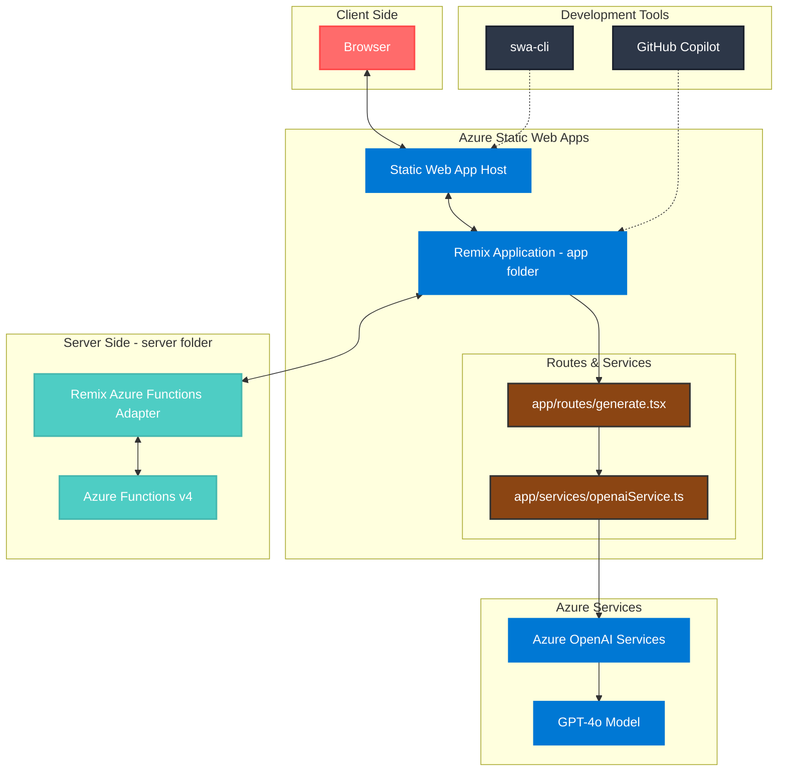

# Microblog AI

Microblog AI é uma aplicação que demonstra o poder do Azure Static Web Apps combinado com Azure Functions e Server-Side Rendering (SSR) usando Remix. A aplicação utiliza a inteligência artificial do GPT-4o da Azure OpenAI para permitir a criação de microblogs de maneira simples e intuitiva.

## Índice

- [Microblog AI](#microblog-ai)
  - [Índice](#índice)
  - [Descrição](#descrição)
    - [Por que SSR com Azure Static Web Apps?](#por-que-ssr-com-azure-static-web-apps)
  - [Arquitetura](#arquitetura)
    - [Visão Geral da Arquitetura](#visão-geral-da-arquitetura)
    - [Fluxo de Dados](#fluxo-de-dados)
  - [Pré-requisitos](#pré-requisitos)
    - [Execução do Projeto](#execução-do-projeto)
  - [Funcionalidades](#funcionalidades)
  - [Solução de Problemas](#solução-de-problemas)
    - [Problemas Comuns](#problemas-comuns)
  - [Contribuição](#contribuição)
  - [Licença](#licença)

## Descrição

Microblog AI é uma aplicação web que permite aos usuários criar, editar e visualizar microblogs com a ajuda de um modelo de IA avançado. O principal objetivo desta aplicação é demonstrar como o Azure Static Web Apps, em conjunto com Azure Functions e Server-Side Rendering (SSR) usando o Remix, pode ser utilizado para criar aplicações web modernas, escaláveis e eficientes. Essa abordagem combina os benefícios do SSR, como tempos de carregamento mais rápidos e melhor SEO, com a escalabilidade e facilidade de gerenciamento de uma arquitetura serverless.

A aplicação é projetada para ser fácil de usar, com uma interface amigável que permite aos usuários focarem na escrita de conteúdo. Utilizando GPT-4o da Azure OpenAI, os usuários podem gerar ideias e conteúdos de forma inteligente e rápida. O Microblog AI é ideal para escritores, blogueiros e qualquer pessoa que queira compartilhar suas ideias de maneira eficiente.

### Por que SSR com Azure Static Web Apps?

- **Desempenho Melhorado**: O SSR permite que as páginas sejam renderizadas no servidor e enviadas ao cliente pré-renderizadas, resultando em tempos de carregamento mais rápidos e uma experiência de usuário mais fluida.
- **SEO Aprimorado**: Com SSR, os motores de busca podem indexar o HTML renderizado no servidor, melhorando a visibilidade do site nos resultados de busca.
- **Escalabilidade**: Azure Static Web Apps oferece uma solução escalável e gerenciada para hospedar aplicações web, com integração nativa com Azure Functions para lógica de backend.
- **Desenvolvimento Simplificado**: Com Azure Static Web Apps, é fácil configurar pipelines de CI/CD que automatizam o processo de build e deploy, permitindo uma iteração rápida e eficiente.

Para mais informações sobre a abordagem de Hybrid Apps em Azure Static Web Apps, consulte a [documentação oficial](https://learn.microsoft.com/en-us/azure/static-web-apps/deploy-nextjs-hybrid).

## Arquitetura

### Visão Geral da Arquitetura

A aplicação segue uma arquitetura moderna para web, aproveitando os serviços do Azure e o framework Remix:

1. **Camada Cliente**
   - Interação do navegador com a aplicação web
   - Lida com interações do usuário e envio de formulários

2. **Azure Static Web Apps**
   - **Host de Static Web App**: Gerencia a entrega de conteúdo estático e roteamento
   - **Aplicação Remix** (pasta `app`):
     - Contém a lógica principal da aplicação
     - Gerencia rotas e serviços
     - `generate.tsx`: Responsável pela interface de geração de conteúdo com IA e lógica de formulários
     - `openaiService.ts`: Gerencia a integração com a API Azure OpenAI

3. **Camada Servidor** (pasta `server`)
   - **Azure Functions v4**: Fornece infraestrutura serverless para o backend
   - **Adaptador Remix Azure Functions**: Habilita Server-Side Rendering (SSR)
   - Processa requisições recebidas e gerencia operações SSR

4. **Serviços do Azure**
   - **Azure OpenAI Services**: Fornece capacidades de IA
   - **Modelo GPT-4o**: Responsável pelos recursos de geração de conteúdo

5. **Ferramentas de Desenvolvimento**
   - **swa-cli**: Ferramenta para desenvolvimento local e deploy
   - **GitHub Copilot**: Assistente de desenvolvimento baseado em IA

### Fluxo de Dados

1. Os usuários interagem com a aplicação através do navegador
2. As requisições são tratadas pelo Azure Static Web Apps
3. A aplicação Remix processa essas requisições:
   - Para carregamento de páginas: Utiliza Azure Functions para SSR
   - Para geração de conteúdo com IA: Faz chamadas diretas ao Azure OpenAI através de `openaiService.ts`
4. As respostas são enviadas de volta ao cliente contendo:
   - Conteúdo renderizado no servidor
   - Conteúdo gerado pela IA via Azure OpenAI

Essa arquitetura garante desempenho otimizado através do SSR, mantendo acesso direto aos serviços de IA para geração de conteúdo.

## Pré-requisitos

- Node.js 20.x (necessário para compatibilidade com Azure Functions v4)
- npm ou yarn
- Assinatura do Azure com acesso ao OpenAI Service
- Git
- Visual Studio Code (recomendado)
- Azure Functions Core Tools v4
- Azure Static Web Apps CLI (`npm install -g @azure/static-web-apps-cli`)

### Execução do Projeto

Aqui está um exemplo do projeto Microblog AI em ação:

## Funcionalidades

- Criar e editar microblogs.
- Visualizar microblogs.
- Integração com Azure OpenAI para geração de conteúdo inteligente.

## Solução de Problemas

### Problemas Comuns

1. **Incompatibilidade de versão do Node.js**
   - Erro: "Azure Functions runtime: Version mismatch"
   - Solução: Certifique-se de que está usando Node.js 20.x (`nvm use 20`)

2. **Acesso ao Azure OpenAI**
   - Erro: "Falha na autenticação" ou "Recurso não encontrado"
   - Solução: Verifique suas credenciais do Azure OpenAI e certifique-se de que seu deployment está ativo

3. **Desenvolvimento local**
   - Erro: "Porta já está em uso"
   - Solução: Altere a porta em `local.settings.json` ou finalize o processo que está usando a porta atual.

## Contribuição

Contribuições são bem-vindas! Sinta-se à vontade para abrir issues e pull requests para melhorias, correções de bugs ou novas funcionalidades.

## Licença

Este projeto está licenciado sob a licença MIT. Ao contribuir para este repositório, você concorda que suas contribuições serão licenciadas sob a licença MIT. Para mais detalhes, consulte o arquivo [LICENSE](LICENSE).
