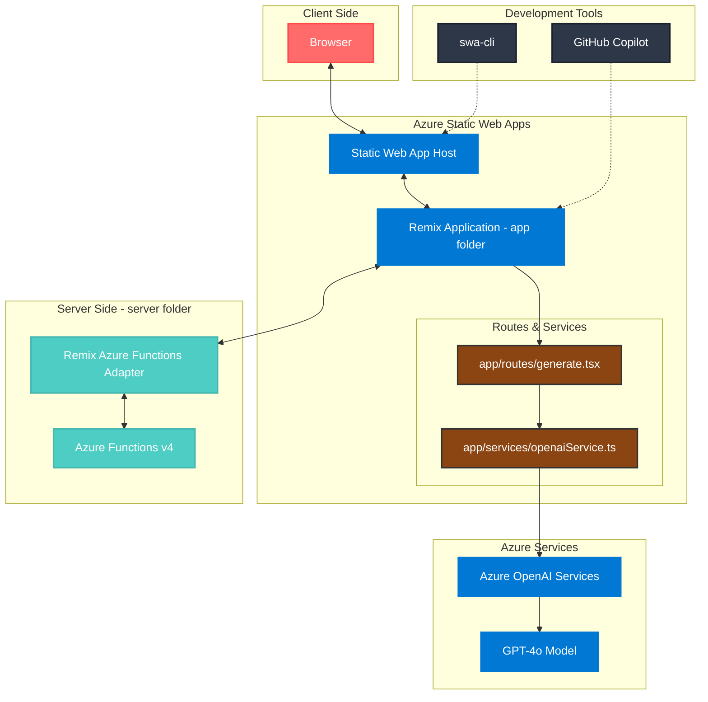

# Microblog AI

Microblog AI is an application that showcases the power of Azure Static Web Apps combined with Azure Functions and Server-Side Rendering (SSR) using Remix. The application leverages Azure OpenAI's GPT-4o artificial intelligence to enable the creation of microblogs in a simple and intuitive way.


## Table of Contents

- [Microblog AI](#microblog-ai)
  - [Table of Contents](#table-of-contents)
  - [Description](#description)
    - [Why SSR with Azure Static Web Apps?](#why-ssr-with-azure-static-web-apps)
  - [Architecture](#architecture)
    - [Architecture Overview](#architecture-overview)
    - [Data Flow](#data-flow)
  - [Prerequisites](#prerequisites)
    - [Project Execution](#project-execution)
  - [Features](#features)
  - [Technologies Used](#technologies-used)
  - [Installation](#installation)
  - [Troubleshooting](#troubleshooting)
    - [Common Issues](#common-issues)
  - [Contribution](#contribution)
  - [License](#license)

## Description

Microblog AI is a web application that allows users to create, edit, and view microblogs with the assistance of an advanced AI model. The main goal of this application is to demonstrate how Azure Static Web Apps, combined with Azure Functions and Server-Side Rendering (SSR) using Remix, can be used to build modern, scalable, and efficient web applications. This approach combines the benefits of SSR, such as faster load times and improved SEO, with the scalability and ease of management of a serverless architecture.

The application is designed to be user-friendly, with an intuitive interface that allows users to focus on writing content. Using Azure OpenAI's GPT-4o, users can generate ideas and content quickly and intelligently. Microblog AI is ideal for writers, bloggers, and anyone who wants to share their ideas efficiently.

### Why SSR with Azure Static Web Apps?

- **Improved Performance**: SSR enables pages to be rendered on the server and sent to the client pre-rendered, resulting in faster load times and a smoother user experience.
- **Enhanced SEO**: With SSR, search engines can index the server-rendered HTML, improving the website's visibility in search results.
- **Scalability**: Azure Static Web Apps provides a scalable and managed solution for hosting web applications, with native integration with Azure Functions for backend logic.
- **Simplified Development**: With Azure Static Web Apps, setting up CI/CD pipelines is easy, automating the build and deployment process for rapid and efficient iterations.

For more information on the Hybrid Apps approach in Azure Static Web Apps, refer to the [official documentation](https://learn.microsoft.com/en-us/azure/static-web-apps/deploy-nextjs-hybrid).

## Architecture



### Architecture Overview

The application follows a modern web architecture leveraging Azure services and Remix framework:

1. **Client Side**
   - Browser interaction with the web application
   - Handles user interactions and form submissions

2. **Azure Static Web Apps**
   - **Static Web App Host**: Manages static content delivery and routing
   - **Remix Application** (`app` folder):
     - Contains the main application logic
     - Houses routes and services
     - `generate.tsx`: Handles AI content generation UI and form logic
     - `openaiService.ts`: Manages Azure OpenAI API integration

3. **Server Side** (`server` folder)
   - **Azure Functions v4**: Provides serverless backend infrastructure
   - **Remix Azure Functions Adapter**: Enables Server-Side Rendering (SSR)
   - Processes incoming requests and handles SSR operations

4. **Azure Services**
   - **Azure OpenAI Services**: Provides AI capabilities
   - **GPT-4o Model**: Powers the content generation features

5. **Development Tools**
   - **swa-cli**: Local development and deployment tool
   - **GitHub Copilot**: AI-powered development assistant

### Data Flow

1. Users interact with the application through their browser
2. Requests are handled by Azure Static Web Apps
3. The Remix application processes these requests:
   - For page loads: Uses Azure Functions for SSR
   - For AI generation: Directly calls Azure OpenAI through `openaiService.ts`
4. Responses are sent back to the client with either:
   - Server-rendered content
   - AI-generated content from Azure OpenAI

This architecture ensures optimal performance through SSR while maintaining direct access to AI services for content generation.  

## Prerequisites

- Node.js 20.x (Required for Azure Functions v4 compatibility)
- npm or yarn
- Azure subscription with OpenAI Service access
- Git
- Visual Studio Code (recommended)
- Azure Functions Core Tools v4
- Azure Static Web Apps CLI (`npm install -g @azure/static-web-apps-cli`)

### Project Execution

Here is an example of the Microblog AI project in action:


## Features

- Create and edit microblogs.
- View microblogs.
- Integration with Azure OpenAI for intelligent content generation.

## Technologies Used

- **[Remix](https://remix.run/)**: Used to build the web application with a server-side and client-side rendering approach, providing a faster and more efficient user experience.
- **[Tailwind CSS](https://tailwindcss.com/)**: Used for fast and customizable styling, enabling the creation of modern and responsive interfaces.
- **[TypeScript](https://www.typescriptlang.org/)**: Adds static typing to JavaScript, helping prevent common errors and improving code maintainability.
- **[Azure OpenAI](https://learn.microsoft.com/azure/ai-services/openai/)**: Azure API used to integrate the GPT-4o model, responsible for generating intelligent content for microblogs.
- **[Azure Static Web Apps](https://learn.microsoft.com/azure/static-web-apps/overview)**: Service used to host the web application in a scalable and cost-effective way, integrated with CI/CD pipelines.
- **[Azure Functions](https://learn.microsoft.com/azure/azure-functions/)**: Used to create serverless functions that handle the application's backend logic, allowing automatic scaling as needed.
- **[GitHub Copilot](https://github.com/features/copilot)**: AI-powered coding assistant that helps accelerate development by providing context-based code suggestions.
- **[Remix Azure Functions Adapter](https://github.com/scandinavianairlines/remix-azure-functions)**: Adapter used to integrate Remix with Azure Functions, facilitating SSR implementation.
- **[swa-cli](https://learn.microsoft.com/azure/static-web-apps/static-web-apps-cli-overview)**: Command-line utility for local development and deployment of Azure Static Web Apps.

> **Note**: This project uses Azure Functions v4 programming model, which requires Node.js versions up to 20.x for compatibility.

## Installation

To run this application locally, follow these steps:

1. **Fork the Repository**:
   - Visit [glaucia86/microblog-ai](https://github.com/glaucia86/microblog-ai) and click the "Fork" button to create a copy of the project in your GitHub account.

2. **Clone the Forked Repository**:
   - Clone the forked repository to your local environment and navigate to the project directory:

```bash
git clone <your-fork-url>
cd microblog-ai
```

3. **Install Dependencies:**
   - Install all project dependencies using npm:

```bash
npm install
```

4. **Environment Configuration:**

   - Create a `.env` file in the project's root directory with the following environment variables:

```bash
AZURE_OPENAI_API_KEY=<your-azure-openai-key>
AZURE_OPENAI_ENDPOINT=<your-openai-endpoint>
AZURE_OPENAI_DEPLOYMENT_NAME=<your-openai-model>
AZURE_OPENAI_API_VERSION=<your-openai-api-version>
```

5. **Azure Functions Configuration:**

  - Create a `local.settings.json` file in the `server` folder with the following content:

```json
{
  "IsEncrypted": false,
  "Values": {
    "AzureWebJobsStorage": "UseDevelopmentStorage=true",
    "FUNCTIONS_WORKER_RUNTIME": "node"
  },
  "Host": {
    "LocalHttpPort": 7071,
    "CORS": "*",
    "CORSCredential": true
  }
}
```

6. **Build the Project:**

   - To compile the project, run:

```bash
npm run build
```

   - Or to compile both the root and server (where Azure Functions are located), run:

```bash
npm run build:all
```

7. **Run the Application:**

   - To start the development server locally, run:

```bash
npm run dev
```

8. **Simulate Production Environment:**

   - To simulate how the project would run on Azure Static Web Apps, use the command:

```bash
swa start
```

The application will be available at `http://localhost:4280`.

> **Important**: This application requires an Azure subscription with access to Azure OpenAI Service. Ensure you have:
> - An active Azure subscription
> - Access to Azure OpenAI Service
> - A deployed GPT-4 model named 'gpt-4o'
> - Valid API credentials (endpoint and key)

For more information on deploying an LLM model in Azure Foundry, refer to the [official documentation](https://learn.microsoft.com/en-us/azure/ai-studio/concepts/deployments-overview).

## Troubleshooting

### Common Issues

1. **Node.js Version Mismatch**
   - Error: "Azure Functions runtime: Version mismatch"
   - Solution: Ensure you're using Node.js 20.x (`nvm use 20`)

2. **Azure OpenAI Access**
   - Error: "Authentication failed" or "Resource not found"
   - Solution: Verify your Azure OpenAI credentials and ensure your deployment is active

3. **Local Development**
   - Error: "Port already in use"
   - Solution: Change the port in `local.settings.json` or kill the process using the current port.

## Contribution

Contributions are welcome! Feel free to open issues and pull requests for improvements, bug fixes, or new features.

## License

This project is licensed under the MIT License. By contributing to this repository, you agree that your contributions will be licensed under the MIT license. For more details, see the [LICENSE](LICENSE) file.
